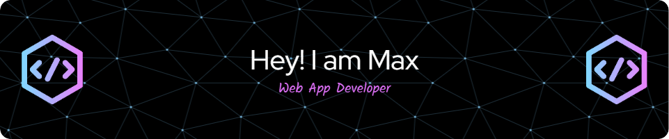

🔧 Backend: Spring Boot (API REST)  
🎨 Frontend: Angular 20 + TypeScript (Composition API, Tailwind CSS, DaisyUI)  
🧪 Design System: Atomic Design  
🌐 Passionate about clean code, performance, and features  

---

## 📊 GitHub Stats

---

## 🧠 Most Used Languages

---

## 🚀 Tech Stack

---
## 📫 Let's Connect

 💼 [LinkedIn](https://www.linkedin.com/)
 
 

---

> 💬 “Code is like humor. When you have to explain it, it’s bad.” – Cory House
